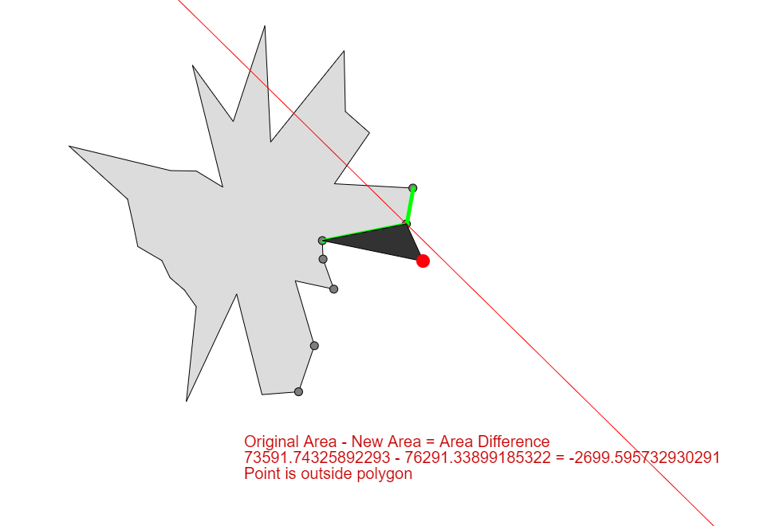

# Area Point Inside Algorithm

### Introduction

This is another algorithm to [determine if a query point is inside a polygon](https://en.wikipedia.org/wiki/Point_in_polygon). It's based on the idea of comparing the areas of the polygon with and without the query point. It's a relatively heavy algorithm compared to the other better options like [Raycast algorithm](https://en.wikipedia.org/wiki/Point_in_polygon#Ray_casting_algorithm) or [Winding number algorithm](https://en.wikipedia.org/wiki/Point_in_polygon#Winding_number_algorithm) and even has quadratic time complexity O(n x n), where n is the number of vertices of the polygon, while these algorithms have O(n). It was developed purely as a learning experience to try to implement a new idea for a algorithm on an already mature and solved problem.

This repository features an implementation in Javascript using p5.js to draw the result and also a C++ implementation using SFML.

### Description

Given the query point Q and the polygon P(concave or convex) the algorithm follows these simple steps:

1. Calculate A, the area P
2. Copy the vertices of P to a new structure NP
3. Remove from NP all the vertices that aren't visible from Q
4. Select the vertex C, the closest of the remaining vertices of NP to the point Q
5. Calculate the bisector vector B between the neighboring edges at C
6. Identify which side of B the point Q is on
7. Break the edge passing on C based on the side Q is on in relation to B
8. Add vertex Q to the polygon P
9. Calculate NA, the new area of P
10. Compare A and NA and reach conclusions about point Q

Although fairly extensive, it's quite easy to understand how it works visually. [Here](https://dozed12.github.io/area-point-inside/) is a live example of it working, querying the mouse cursor if it's inside or outside the polygon.

The algorithm is composed of smaller more common problems such as: calculating the area of a polygon, checking for the intersection of 2 line segments and checking which side of a line a point is located. Most of these problems have linear complexity O(n) or lower, however to detect which vertices of P are visible to Q we require to do "checking for the intersection of 2 line segments" with quadratic complexity O(n x n) where n is the number of vertices of P. This is what causes the entire algorithm to have O(n x n) complexity. Unfortunatly as much as I researched there doesn't seem to be any better alternative to this. Perhaps if a better solution is found then this algorithm could be more useful but for now there isn't much reason to use it. Even if there's a way to reduce the complexity to O(n) the algorithm will still likely be slower than the other options considering it has many more complex operations to do.

### Some Benchmark values

The C++ implementation is made to compare the performance of this algorithm and the other 2 popular ones. As expected, due to the much more complex operations of this algorithm and the higher time complexity, this algorithm is much slower than the other options.

Testing an area of 400 x 400 points around a concave polygon with 50 vertices produced these results:

- Area Algorithm counted 75641/160000 points inside in: 4470 ms
- Raycast Algorithm counted 75641/160000 points inside in: 37 ms
- Winding Algorithm counted 75684/160000 points inside in: 16 ms

### Notes

- There are several optimizations that can be done to both implementations, however given the complexity problem there isn't much point in trying to do them for now.
- There are a lot of algorithms to detect the intersection of 2 line segments available online but it's important to note that they may classify intersection or not differently in some specific cases.
